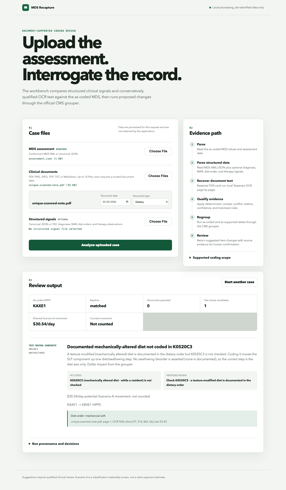

# MDS Recapture Workbench

A local, review-oriented prototype for one narrow skilled-nursing workflow: compare an as-coded
FY2026 MDS assessment with dated structured signals and uploaded clinical documents, construct
supported counterfactual item changes, and run both states through the official CMS PDPM grouper.

This is a portfolio prototype—not a medical device, autonomous coder, claims system, or production
PHI environment. Use de-identified synthetic data only.



## What is real

- Multipart upload of MDS XML/JSON, clinical documents, and structured-signal JSON/CSV.
- PDF rasterization with Poppler and page-by-page OCR with local Tesseract.
- OCR page, confidence, exact-text offsets, and bounding-box preservation.
- Deterministic look-back, current-status, scoped-negation, conflict, and citation checks.
- Official CMS PDPM Grouper V2.4000 execution on Java 17.
- As-coded and counterfactual HIPPS plus an illustrative FY2026 Scenario-A rate difference.

There is no LLM in the public runtime. Text rules use deliberately narrow phrase and context matching.
Text findings are always labeled **Text review candidate** and never enter counted movement.
Structured signals can be **Structured supported**, but count only when the caller supplies a
reconciled `claim_paid` or `iqies_accepted` HIPPS that matches the grouper's as-coded HIPPS.

## Supported scope

- Assessment dates: October 1, 2025 through September 30, 2026.
- Unstructured NTA: chronic pancreatitis (`K86.1`) and proliferative diabetic retinopathy with
  macular edema (`E11.351`) with separate current diagnosis and active-treatment evidence.
- Structured Section I: six primary-diagnosis checkbox classes.
- Section K: selected mechanically altered diet and swallowing phrases, including `K0520C3`.
- Section GG: selected walking and transfer tasks with same-sentence assistance mappings.

See [docs/rule-scope.md](docs/rule-scope.md) for exact limitations.

## Five-minute Docker run

Docker needs build-time internet access to download the checksum-pinned grouper package directly
from CMS. No CMS JAR is stored in this repository.

```bash
docker build --no-cache -t mds-recapture-workbench .
docker run --rm -p 8000:8000 mds-recapture-workbench
```

Open `http://127.0.0.1:8000`. Runtime processing is local and request-scoped.

For local development, install Java 17, Tesseract, and Poppler, then run:

```bash
uv sync --frozen --extra dev
make cms
make demo
```

## Request contract

`POST /api/analyze` accepts multipart fields:

- `assessment`: required MDS XML or canonical JSON.
- `documents`: zero to ten PDF, PNG, JPEG, TIFF, TXT, or Markdown documents.
- `document_metadata`: required JSON array when documents are present.
- `signals`: optional canonical structured-signal JSON or CSV.
- `case_id`: optional de-identified case label, primarily useful for XML uploads.

At least one document or structured-signal file is required. Dates come only from metadata or
structured records; dates appearing in filenames or OCR text are never trusted.

```json
[
  {
    "filename": "diet-note.pdf",
    "document_date": "2026-05-20",
    "document_type": "dietary"
  }
]
```

Canonical assessment JSON:

```json
{
  "stay_id": "synthetic-stay-123",
  "assessment_type": "01",
  "ard": "2026-05-22",
  "a2400b": "2026-05-17",
  "a2400c": "2026-06-16",
  "baseline": {
    "source": "claim_paid",
    "hipps": "KAXE1",
    "reconciled": true
  },
  "items": {
    "I0020B": "I50.22",
    "K0520C3": "0"
  }
}
```

Structured-only requests are supported. For example:

```json
{
  "signals": [
    {
      "signal_type": "diet_order",
      "trust": "order_active",
      "value": "Diet order: mechanical soft",
      "effective_date": "2026-05-20",
      "source_table": "diet_orders:synthetic-1"
    }
  ]
}
```

## Interpretation of results

- `structured_supported`: qualifying structured evidence; counted only with a matched baseline.
- `text_review_candidate`: deterministic OCR/native-text candidate; potential what-if only.
- `review_flag`: contradictory or possible over-capture evidence; no favorable dollar.

Scenario A uses an urban, national-unadjusted single-assessment rate comparison. It excludes wage
index, sequestration, VBP, interrupted stays, denials, payment corrections, and claim history. It is
not a claim-level reimbursement estimate or a promise of recoverable revenue.

## Verification

```bash
make verify
```

The suite generates fresh assessments and scanned PDFs at runtime. It does not seed the application
from resident fixtures or expected-result files. See [docs/architecture.md](docs/architecture.md),
[SECURITY.md](SECURITY.md), and [THIRD_PARTY_NOTICES.md](THIRD_PARTY_NOTICES.md).
